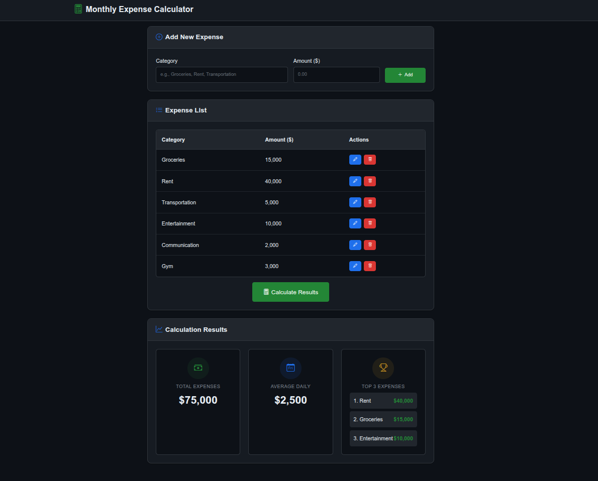
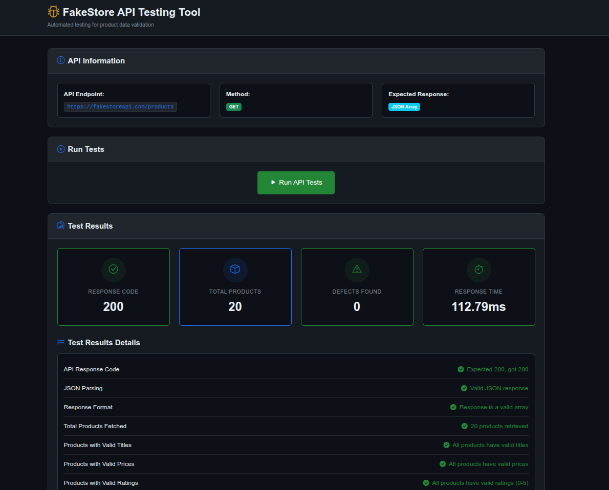
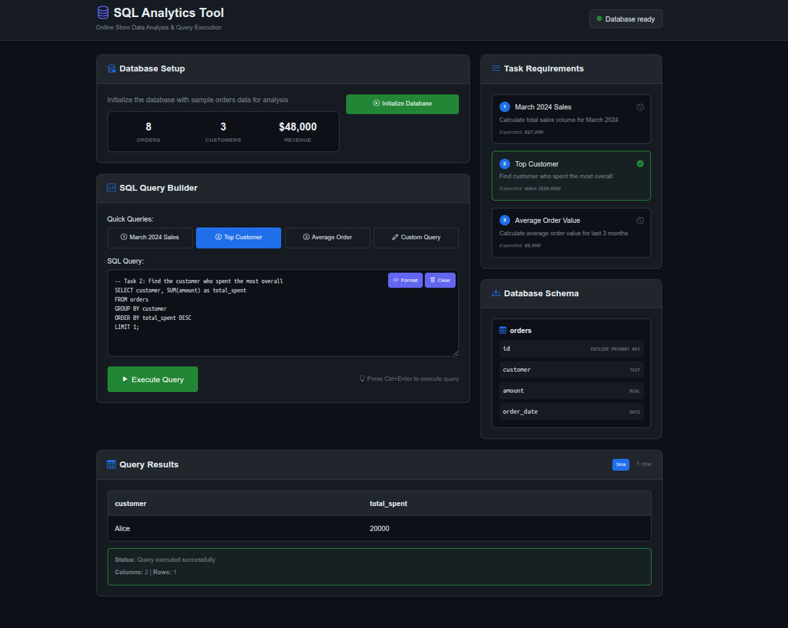

# AI Skills Assessment Tasks

## 📋 Project Overview

This repository contains three web development tasks completed as part of an artificial intelligence skills assessment. Each task demonstrates different aspects of modern web development including frontend functionality, API integration, and database analysis.

## 🚀 Completed Tasks

### [Task 1: Monthly Expense Calculator](./Task%201/README.md)
Interactive expense tracking application with monthly calculations and edit functionality.
- **Tech Stack**: HTML, CSS, JavaScript
- **Features**: Expense management, monthly totals, edit/delete functionality



### [Task 2: API Testing Tool](./Task%202/README.md)
Comprehensive API testing tool for FakeStore API with data validation and modern UI.
- **Tech Stack**: HTML, CSS, JavaScript, PHP
- **Features**: API requests, data validation, dark theme interface



### [Task 3: SQL Analytics Tool](./Task%203/README.md)
Advanced SQL analytics tool with in-browser SQLite database for sales data analysis.
- **Tech Stack**: HTML, CSS, JavaScript, SQLite.js
- **Features**: Database queries, task validation, interactive analytics



## 👨‍💻 Development Information

**Author**: Igor Novak  
**Position**: Junior+ PHP Developer  
**Company**: Innowise (PHP Department)  
**Role**: AI Work Supervision and Control  

## 🤖 AI Development Disclosure

**⚠️ Important Notice**: This repository and all code contained within are the result of work performed by the **Claude-4-Sonnet (Thinking Model)** artificial intelligence in **2025**. 

**The code was NOT written by a human developer.**

- **AI Model**: Claude-4-Sonnet (Thinking Model)
- **Development Year**: 2025
- **AI Supervision**: Igor Novak
- **Quality Control**: Human oversight and testing

This project demonstrates the capabilities of modern AI in web development, including:
- Modern frontend development practices
- API integration and testing
- Database design and SQL analytics
- Responsive UI/UX design
- Code architecture and documentation

## 📁 Repository Structure

```
AI Tasks/
├── Task 1/                 # Monthly Expense Calculator
│   ├── index.html
│   ├── styles.css
│   ├── script.js
│   └── README.md
├── Task 2/                 # API Testing Tool
│   ├── index.html
│   ├── styles.css
│   ├── script.js
│   ├── api.php
│   └── README.md
├── Task 3/                 # SQL Analytics Tool
│   ├── index.html
│   ├── styles.css
│   ├── script.js
│   └── README.md
└── README.md              # This file
```

## 🔧 Quick Start

Each task is self-contained and can be run independently:

1. **Navigate to the desired task folder**
2. **Start a local server** (recommended):
   ```bash
   # For Tasks 1 & 3
   python -m http.server 8080
   
   # For Task 2 (requires PHP)
   php -S localhost:8080
   ```
3. **Open your browser** and navigate to `http://localhost:8080`

## 📜 License

This project is created for educational and assessment purposes, demonstrating AI capabilities in modern web development.

---

**Generated by**: Claude-4-Sonnet (Thinking Model) AI  
**Supervised by**: Igor Novak  
**Year**: 2025
